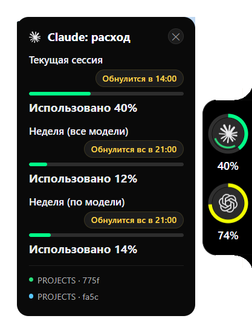

<div align="center">

# Codenotch для Windows

**Маленькая чёрная «пилюля» у правого края экрана: сколько лимита Claude Code, Codex и Antigravity
уже потрачено и работает ли Claude прямо сейчас.**

[](https://github.com/kaizento/codenotch-windows/actions/workflows/windows-build.yml)

-orange)

[](LICENSE)



[English version](README.md)

</div>

Это форк [vinzdg/codenotch](https://github.com/vinzdg/codenotch). Оригинал — приложение для macOS
(`Sources/`); его порт на Windows (`windows/`, Rust + Tauri 2 / WebView2) — то, что этот репозиторий
собирает, выпускает и поддерживает. Код macOS оставлен в дереве только для слияния изменений из
оригинала, здесь он не меняется.

**Что добавляет форк:** русская локаль, кнопка закрытия на карточке, регион окна (прозрачная часть
окна больше не съедает клики), крупнее шрифт карточки, время обнуления чипом и выключенная ячейка
Cursor. Подробности в разделе [Что меняет форк](#что-меняет-форк) и в [`CHANGELOG.md`](CHANGELOG.md).

## Содержание

- [Что показывает](#что-показывает)
- [Как читать пилюлю](#как-читать-пилюлю)
- [Установка](#установка)
- [Работа с панелью](#работа-с-панелью)
- [Хуки Claude Code](#хуки-claude-code)
- [Настройки и данные](#настройки-и-данные)
- [Сборка из исходников](#сборка-из-исходников)
- [Структура репозитория](#структура-репозитория)
- [Что меняет форк](#что-меняет-форк)
- [Синхронизация с оригиналом](#синхронизация-с-оригиналом)
- [Ограничения](#ограничения)
- [Если что-то не так](#если-что-то-не-так)
- [Участие, безопасность, правила](#участие-безопасность-правила)
- [Лицензия и авторы](#лицензия-и-авторы)

## Что показывает

По одной ячейке на провайдера, сверху вниз. Провайдер, который не установлен или не залогинен,
ячейки не получает.

| Ячейка | Откуда цифра | Что видно |
|---|---|---|
| **Claude** | `GET https://api.anthropic.com/api/oauth/usage` с OAuth-токеном, который Claude Code хранит в `~/.claude/.credentials.json` | Текущая сессия и недельные окна с временем обнуления. На 429 опрос отступает (60 с, удваивается, потолок 15 мин), срок хранится на диске — перезапуск не тратит лишнюю попытку. Тонкая дуга крутится внутри кольца, пока сессия Claude Code работает, и пульсирует янтарным, когда сессия ждёт вас. |
| **Codex** | `GET https://chatgpt.com/backend-api/wham/usage` с сессией из `~/.codex/auth.json` (только чтение, не обновляется); запасной вариант — снимок `rate_limits` из свежего rollout-лога | Живые 5-часовое и недельное окна на платных планах, месячное на бесплатном; иначе последний снимок, помеченный устаревшим по его же времени. |
| **Antigravity** | Локальный мост `language_server` (сводка квоты), затем Cloud Code API Google для лицензированных аккаунтов, затем простой счётчик сегодняшних ходов модели | Процент, когда он есть, `~счётчик`, когда нет — выдуманных чисел не бывает. |
| Cursor | — | **В этой сборке выключен.** `CURSOR_ENABLED = false` в `windows/codenotch/src/main.rs`; поставьте `true` и пересоберите. |

Каждый адаптер читает то же, что читает сам инструмент-владелец; эти эндпоинты внутренние и могут
измениться без предупреждения. Сбой превращается в видимое состояние — устарело, нужен вход, ждём
первое показание, — а не в придуманный процент.

## Как читать пилюлю


- **Кольцо** — самое тесное окно провайдера, то, которое остановит вас первым. Зелёное до 50 %,
  жёлтое с 50 %, красное с 80 %.
- **Процент** под кольцом — то же окно. `~` впереди значит, что число вычислено, а не получено от
  вендора.
- **Приглушённая ячейка** — показание устарело: старше пяти минут либо провайдер сам так сказал.
- **Тонкая крутящаяся дуга** в кольце Claude — сессия Claude Code работает прямо сейчас.
  **Пульсирующее янтарное кольцо** — сессия ждёт вас (запрос разрешения, вопрос).
- **Наведите** на ячейку — откроется карточка: все окна лимита с полосками, время обнуления чипом
  (`Обнулится через 12 мин`, `Обнулится в 14:00`, `Обнулится вс в 21:00`) и живые сессии Claude Code
  по именам.
- **Крестик** справа вверху карточки закрывает приложение.

<br clear="right">

## Установка

### Скачать

Возьмите `codenotch.exe` и `codenotch-hook.exe` из [последнего релиза](../../releases/latest) и
положите в любую постоянную папку (например `%LOCALAPPDATA%\Codenotch\`). Запустите `codenotch.exe` —
пилюля появится у правого края основного монитора по центру, в трее появится значок.

Требования: Windows 10 или 11, 64-бит, и
[среда WebView2](https://developer.microsoft.com/microsoft-edge/webview2/) — она уже есть в Windows 11
и на любой машине с Edge или Office.

> **SmartScreen.** Файлы не подписаны. При первом запуске Windows покажет «Система Windows защитила
> ваш компьютер» — нажмите *Подробнее → Выполнить в любом случае*. Если неподписанному файлу доверять
> не хочется — [соберите сами](#сборка-из-исходников), это четыре минуты.

Работает только один экземпляр: повторный запуск отклоняется, а работающий показывает заметку на карточке — полезно помнить сразу после пересборки.

### Собрать самому

См. [Сборка из исходников](#сборка-из-исходников). На выходе те же два файла.

## Работа с панелью

| Действие | Что происходит |
|---|---|
| Навести на пилюлю | Открывается карточка для ячейки под курсором; она следует за курсором между ячейками и закрывается через 250 мс после ухода. |
| Клик по ячейке | Открывает страницу расхода этого провайдера в браузере. |
| Зажать и тянуть пилюлю вверх-вниз | Двигает её вдоль правого края; позиция запоминается (`notch_y` в `config.json`). |
| Крестик на карточке | Выход. Снова — запуском файла или через автозапуск из трея. |
| Значок в трее (левая или правая кнопка) | Меню ниже. |

**Меню трея**

- **Установить хуки / Убрать хуки** — подключает или отключает Claude Code, см. [Хуки Claude Code](#хуки-claude-code).
- **Язык** — Авто, 中文, English, 日本語, 한국어, Русский. *Авто* берёт язык интерфейса Windows.
- **Обновить сейчас** — опрашивает всех провайдеров немедленно и перечитывает значки.
- **Сбросить положение** — возвращает пилюлю в центр правого края основного монитора.
- **Открыть папку данных** — `%APPDATA%\codenotch` в Проводнике.
- **Запускать с Windows** — пишет `HKCU\Software\Microsoft\Windows\CurrentVersion\Run\Codenotch` с
  путём к текущему файлу и ключом `--silent`: приложение ждёт в фоне и показывает пилюлю, когда
  начинается сессия. Снять галку — значение удаляется. Путь фиксируется на момент включения:
  переместили файл — включите заново.
- **Выход**

## Хуки Claude Code

Сигнал «работает ли» идёт от самого Claude Code. **Установить хуки** в трее вписывает
`codenotch-hook.exe` в `~/.claude/settings.json` — сначала делается бэкап файла, а трогаются только
записи, в команде которых есть `codenotch-hook`, так что ваши собственные хуки не меняются.

Хук сообщает события работающему приложению по `http://127.0.0.1:<порт>/event` (только loopback,
порт из `config.json`, по умолчанию `48666`), укладываясь в 5 мс:

| Событие Claude Code | Как понимается |
|---|---|
| `SessionStart` | сессия началась |
| `UserPromptSubmit`, `PreToolUse`, `PostToolUse` | работает |
| `Notification` | ждёт вас |
| `Stop` | закончил |
| `SessionEnd` | сессия закончилась |

Наблюдатель за транскриптами закрывает то же самое для сессий, начатых раньше приложения, и для
десктопного приложения. **Убрать хуки** удаляет ровно то, что добавила установка.

## Настройки и данные

Всё лежит в `%APPDATA%\codenotch\`:

| Файл | Назначение |
|---|---|
| `config.json` | Настройки, см. ниже. Создаётся при первом запуске. |
| `usage.json`, `codex.json`, `antigravity.json` | Последнее хорошее показание каждого провайдера, чтобы после перезапуска пилюля не была пустой. |
| `run.log`, `watch.log` | Логи приложения и наблюдателя за транскриптами. Токены туда не пишутся никогда. |
| `glyphs\` | Ваши собственные значки провайдеров, если есть. |

`config.json`:

| Ключ | По умолчанию | Смысл |
|---|---|---|
| `port` | `48666` | Loopback-порт, на который шлёт хук. |
| `lang` | `"auto"` | `auto`, `zh`, `en`, `ja`, `ko`, `ru`. То же, что *Язык* в трее. |
| `notch_y` | `0.5` | Вертикальное положение пилюли в долях высоты монитора. |
| `drag_enabled` | `true` | Можно ли перетаскивать пилюлю. |
| `bar_x`, `bar_y`, `bar_w` | — | Наследие горизонтальной полоски; пилюля их не читает. |

Правьте файл при закрытом приложении: он читается на старте.

**Значки провайдеров.** Иконки в кольцах — SVG из
[`@lobehub/icons-static-svg`](https://github.com/lobehub/lobe-icons) (MIT), встроены без изменений —
см. [`windows/codenotch/glyphs/NOTICE.md`](windows/codenotch/glyphs/NOTICE.md). Положите свои
`claude.svg`, `codex.svg`, `gemini.svg` (или `.png`) в `%APPDATA%\codenotch\glyphs\`, чтобы
подменить. Знаки остаются товарными знаками их владельцев.

**Самодиагностика.** `codenotch.exe doctor` печатает, что приложение видит и чего не видит:
учётные данные, источники, значки, установленные хуки.

## Сборка из исходников

Понадобится:

- **Rust** (stable, цель MSVC) — <https://rustup.rs>.
- **Visual Studio 2022 Build Tools** с рабочей нагрузкой *Разработка классических приложений на C++* —
  ради компоновщика.
- **Среда WebView2** (см. [Установка](#установка)).

```powershell
git clone https://github.com/kaizento/codenotch-windows.git
cd codenotch-windows\windows
cargo build --release           # ~4 мин в первый раз, ~2,5 потом; оба крейта workspace
.\target\release\codenotch.exe
```

На выходе `target\release\codenotch.exe` (~8 МБ, приложение) и `target\release\codenotch-hook.exe`
(посыльный для хуков). Два момента:

- `ui/notch.html` вшивается в бинарник при сборке — любая правка пилюли или карточки требует
  пересборки.
- Запущенный `codenotch.exe` держит свой файл. Закройте его (крестик на карточке или трей → Выход)
  перед сборкой, иначе компоновка упадёт с «Отказано в доступе».

Чтобы держать тулчейн Rust не на системном диске, задайте `RUSTUP_HOME`, `CARGO_HOME` и
`CARGO_TARGET_DIR` в оболочке до `rustup-init` и `cargo build`; проект их расположения не
предполагает.

Воркфлоу [Windows build](.github/workflows/windows-build.yml) собирает то же самое при каждом
изменении в `windows/` и две недели хранит оба файла как артефакт.

## Структура репозитория

```
.
├── windows/                     Приложение для Windows — всё, что выпускает этот репозиторий
│   ├── codenotch/               Крейт приложения на Tauri 2
│   │   ├── src/main.rs          Окно, команды, регион окна, перетаскивание, поправка DPI
│   │   ├── src/tray.rs          Меню трея
│   │   ├── src/i18n.rs          Строки трея и окна; у карточки свой словарь в notch.html
│   │   ├── src/usage.rs         Провайдер Claude       src/codex.rs        Провайдер Codex
│   │   ├── src/antigravity.rs   Провайдер Antigravity  src/cursor.rs       Провайдер Cursor (выкл.)
│   │   ├── src/watcher.rs       Наблюдатель транскриптов  src/state.rs     Движок состояний сессий
│   │   ├── src/server.rs        Loopback-слушатель для хуков
│   │   ├── src/hooks_install.rs Слияние settings.json  src/autostart.rs    Автозапуск через Run
│   │   ├── src/doctor.rs        Подкоманда `doctor`    src/glyphs.rs       Значки провайдеров
│   │   ├── ui/notch.html        Пилюля и карточка — один файл, без фреймворка
│   │   ├── glyphs/              Встроенные значки (+ NOTICE.md)
│   │   └── tauri.conf.json      Описание окна (340×460, прозрачное, поверх всех, без фокуса)
│   ├── codenotch-hook/          Посыльный < 5 мс, которого вызывает Claude Code
│   ├── docs/                    Скриншоты для README
│   └── README.md                Техническое описание порта (от его автора)
├── Sources/, Tests/, Makefile, project.yml, Scripts/, site/, docs/, TASKS.md
│                                Приложение macOS из оригинала, не трогается; сливается как есть
├── .github/workflows/windows-build.yml   CI приложения для Windows
├── .github/workflows/ci.yml, package.yml Воркфлоу macOS из оригинала — в этом репозитории выключены
├── CHANGELOG.md                 История сборки для Windows
├── CONTRIBUTING.md · SECURITY.md · CODE_OF_CONDUCT.md
└── LICENSE                      MIT
```

## Что меняет форк

Относительно дерева `windows/` в `main` оригинала:

1. **Русская локаль** — трей, подписи окна, заметки провайдеров (`i18n.rs`) и карточка
   (`STRINGS.ru` в `notch.html`). `lang: "ru"` или трей → Язык → Русский.
2. **Кнопка закрытия на карточке.** У пилюли нет рамки окна, и раньше выйти можно было только через
   трей. Крестик вызывает команду `quit_app` — то же, что трей → Выход. Реагирует на `mousedown`, а
   не на `click`: карточка перестраивает DOM при каждом обновлении расхода, элемент под курсором
   исчезает до `mouseup`, и `click` тогда не рождается вовсе.
3. **Регион окна.** Окно — лист 340 × 460 CSS px, почти целиком прозрачный, прижатый к правому краю,
   а прозрачный пиксель всё равно принадлежит окну. Любой клик в этой области уходил в пилюлю, а не в
   приложение под ней, и кнопки у правого края экрана переставали нажиматься. `WS_EX_TRANSPARENT` не
   помог бы: мышь ловит дочернее окно WebView2, а не окно Tauri. `SetWindowRgn` на родителе режет
   и дочернее окно. Регион — прямоугольник пилюли, пока карточка свёрнута, и bounding box
   пилюля + карточка, пока раскрыта; страница сообщает оба (`set_pill_rect`, `set_expanded`). Пока
   страница ничего не сообщила, регион снят — пилюля не может отрезать сама себя.
4. **Крупнее шрифт карточки** и **время обнуления чипом** — читается на 27" при 125 %.
5. **Ячейка Cursor выключена** одной константой, см. [Что показывает](#что-показывает).

Всё остальное — провайдеры, движок сессий, DPI, трей — порт в том виде, как он есть в оригинале.

## Синхронизация с оригиналом

```powershell
git remote add upstream https://github.com/vinzdg/codenotch.git   # один раз
git fetch upstream
git merge upstream/main
```

Файлы, которыми владеет форк и которые конфликтуют при каждом изменении оригинала: `README.md`,
`CONTRIBUTING.md` (брать наши) и то, что оригинал тронул в `windows/` (сливать руками — правки форка
небольшие и перечислены выше). `CHANGELOG.md`, `SECURITY.md`, `CODE_OF_CONDUCT.md`, `README.ru.md` и
`.github/workflows/windows-build.yml` в оригинале не существуют и сливаются без конфликтов.

Воркфлоу macOS из оригинала (`ci.yml`, `package.yml`) в настройках Actions этого репозитория
выключены: им нужен раннер macOS и секреты подписи, которые есть только у автора оригинала.

## Ограничения

- Пилюля живёт **только у правого края основного монитора**. Четыре края, как в macOS-версии, не
  портированы.
- **Нет подписи кода** — SmartScreen предупреждает при первом запуске, автообновления нет.
  Следите за [релизами](../../releases) сами.
- **Cursor** в этой сборке выключен (константа, см. выше).
- **Хуки не ставятся сами** — трей → Установить хуки, один раз.
- Одна пилюля на учётную запись машины: два входа Claude Code (`CLAUDE_CONFIG_DIR`) двумя
  кольцами не показываются, в отличие от macOS-версии.

## Если что-то не так

| Симптом | Что проверить |
|---|---|
| После запуска нет пилюли | Возможно, режим `--silent` и ни одной сессии — начните сессию Claude Code или запустите файл без аргументов. Трей → Сбросить положение, если пилюлю утащили за экран на мониторе, которого уже нет. |
| В ячейке `—` | Провайдеру нужен вход: наведите, прочтите заметку. Claude читает `~/.claude/.credentials.json`, Codex — `~/.codex/auth.json`. Запустите `codenotch.exe doctor`. |
| Ячейка приглушена | Показание старше пяти минут. Трей → Обновить сейчас; при 429 срок отступа записан в `run.log`. |
| Клики у правого края экрана уходят в никуда | В этом форке починено (регион окна). Если вернулось — в `run.log` видны прямоугольники, которые сообщила страница. |
| Карточка не того размера на масштабированном экране | `run.log` хранит отчёт о DPI и применённую поправку масштаба; страница сама поправляется CSS-зумом. Откройте issue с этими строками и вашим масштабом. |
| Сборка падает с «Отказано в доступе» на `codenotch.exe` | Приложение запущено — сначала закройте. |

Лог — `%APPDATA%\codenotch\run.log` (трей → Открыть папку данных). Токенов в нём не бывает.

## Участие, безопасность, правила

- [CONTRIBUTING.md](CONTRIBUTING.md) — сборка, что проверить перед PR, этикет по отношению к оригиналу.
- [SECURITY.md](SECURITY.md) — что читает приложение и как приватно сообщить об уязвимости.
- [CODE_OF_CONDUCT.md](CODE_OF_CONDUCT.md).
- Ошибки в приложении для Windows — [issue](../../issues/new/choose). Ошибки macOS-версии — в
  [оригинал](https://github.com/vinzdg/codenotch/issues).

## Лицензия и авторы

[MIT](LICENSE).

- **Codenotch** — дизайн, имя и приложение для macOS: [Vinz](https://github.com/vinzdg),
  [vinzdg/codenotch](https://github.com/vinzdg/codenotch).
- **Порт на Windows** (`windows/`) — [Im-Midi](https://github.com/Im-Midi/codenotch-windows),
  предложен оригиналу как его дерево `windows/`; движок обнаружения сессий родом из
  [Im-Midi/Pac-Man](https://github.com/Im-Midi/Pac-Man) (MIT).
- **Значки провайдеров** — [`@lobehub/icons-static-svg`](https://github.com/lobehub/lobe-icons) (MIT);
  сами знаки — товарные знаки их владельцев.
- **Этот форк** — [kaizento](https://github.com/kaizento).
